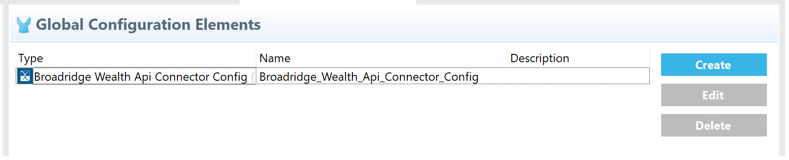
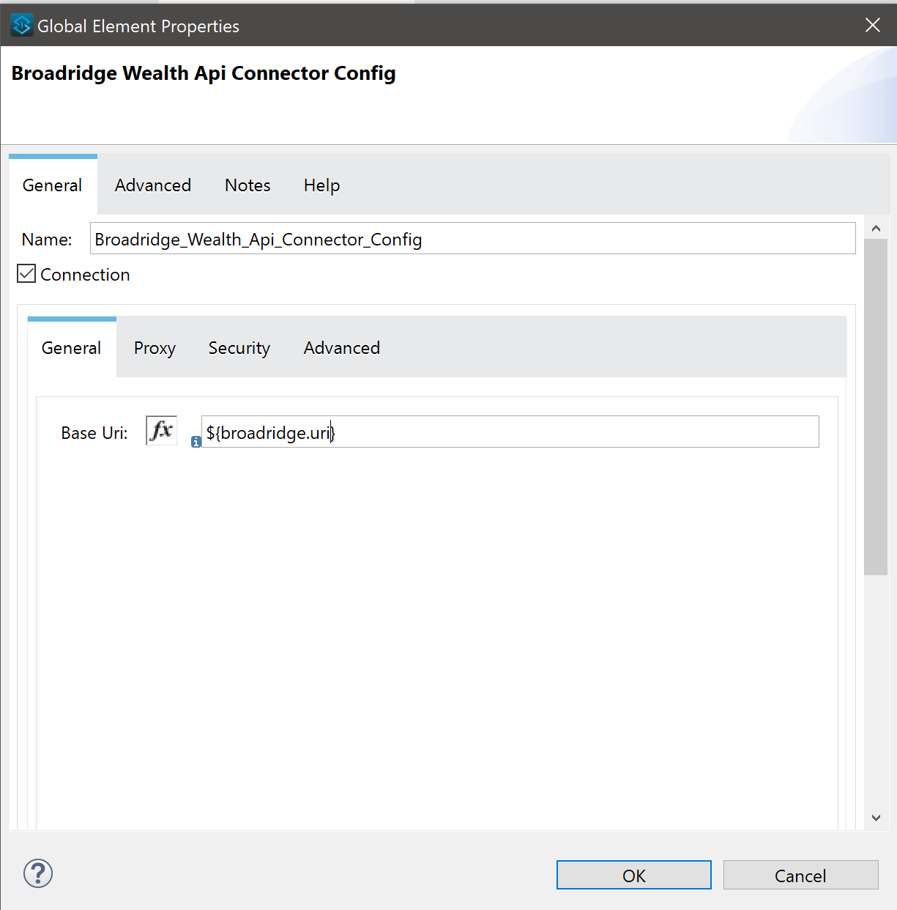
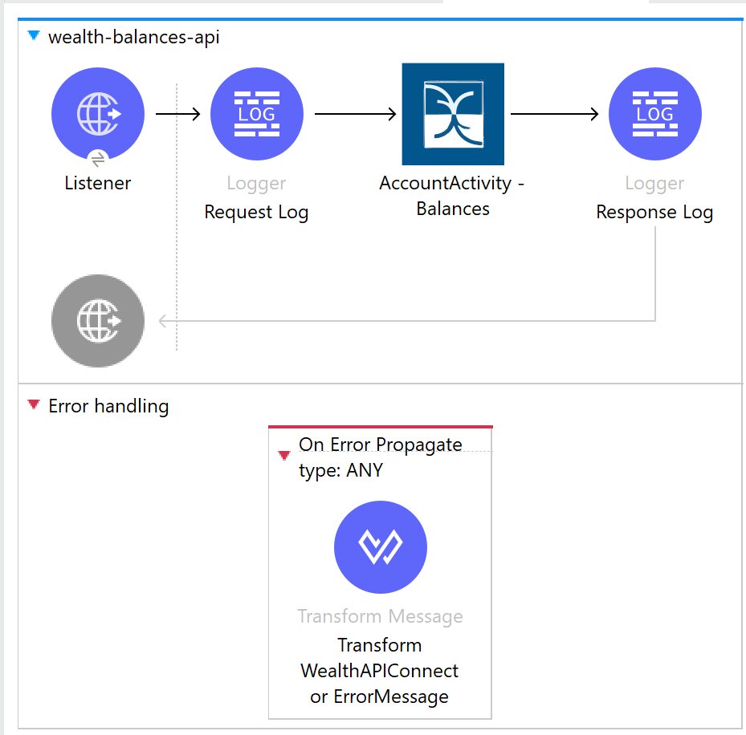

= Broadridge Wealth API Connector User Manual

== Introduction

Broadridge Wealth API Connector allows you to retrieve Account Activity ((Balance, Positions, Transactions) and Client Services (Accounts and Parties) data unlocking access to real-time Broadridge APIs and powering next-generation wealth management business process.

Read through this user guide to understand how to set up and configure a basic flow using the connector. Track feature additions, compatibility, limitations and API version updates with each release of the connector using the https://github.com/wealthapiconnector/Broadridge-Wealth-API-Docs/blob/main/release-notes.adoc[Connector Release Notes]. Review the connector operations and functionality using the https://github.com/wealthapiconnector/Broadridge-Wealth-API-Docs/blob/main/technical-reference.adoc[Technical Reference] alongside the demo application.

MuleSoft maintains this connector under the https://docs.mulesoft.com/connectors/introduction/introduction-to-anypoint-connectors#connector-support-categories[MuleSoft Certified Category] support policy.

== Prerequisites

Reach out to Broadridge @ wealthapiconnector <wealthapiconnector@broadridge.com> to complete the User Onboarding process to use this connector. 

This document assumes that you are familiar with Mule 4, https://docs.mulesoft.com/connectors/introduction/introduction-to-anypoint-connectors[Anypoint Connectors], and https://docs.mulesoft.com/studio/7.15/[Anypoint Studio]. To increase your familiarity with Studio, consider completing a https://docs.mulesoft.com/studio/7.15/[Anypoint Studio] Tutorial. This page requires some basic knowledge of https://docs.mulesoft.com/mule-runtime/latest/[Mule Concepts], https://docs.mulesoft.com/mule-runtime/latest/mule-components[Components in a Mule Flow], and https://docs.mulesoft.com/mule-runtime/4.3/global-elements[Global Elements].

[[requirements]]
== Hardware and Software Requirements
For hardware and software requirements, please visit the Hardware and https://docs.mulesoft.com/mule-runtime/4.3/hardware-and-software-requirements[Software Requirements page].

=== Mule Compatibility
[%header%autowidth.spread]
|===
|Application/Service |Version
|Mule Runtime |4.3.x and later
|Anypoint Studio | 7.15.x and later

|===

== Installing the Connector

* You can install the connector in Anypoint Studio using the instructions in https://docs.mulesoft.com/exchange/#installing-a-connector-from-anypoint-exchange[Installing a Connector from Anypoint Exchange.]

== Maven Dependency Information
After downloading and installing the connector, following steps make the Broadridge Wealth API Connector available inside a Mule application for use and to package the application with connector. If using Anypoint Studio, it will do this automatically. For Maven dependency management, include this XML snippet in pom.xml file in the Mule project.

       <dependency>
		<groupId>com.mulesoft.connectors</groupId>
		<artifactId>mule4-broadridge-wealth-api-connector</artifactId>
    		<version>1.0.0</version>
            	<classifier>mule-plugin</classifier>
        </dependency>

== How to Configure

* After adding connector dependency to Mule project, click on *Global Elements* tab at the base of the canvas.
* In the Global Mule Configuration Elements screen, click *Create*.
* In the Choose Global Type wizard, collapse connector configuration and select *'Broadridge Wealth API Connector Config'* and click OK.

[%header%autowidth.spread]
|===
|Field Name |Type |Value
|Base Uri |String |Enter the base URI of your Broadridge instance.
|===

[[ns-schema]]
== Connector Namespace and Schema

When designing your application in Anypoint Studio, when you drag the connector from the palette onto the Anypoint Studio canvas, Studio automatically populates the XML code with the connector *namespace* and *schema location*.

*Namespace:* `+http://www.mulesoft.org/schema/mule/connector+` +
*Schema Location:* `+http://www.mulesoft.org/schema/mule/connector/current/mule-connector.xsd+`

[TIP]
If you are manually coding the Mule application in Studio's XML editor or another text editor, define the namespace and schema location in the header of your *Configuration XML*, inside the `<mule>` tag.

----
<mule xmlns:broadridge-wealth-api-connector="http://www.mulesoft.org/schema/mule/broadridge-wealth-api-connector"
      xmlns="http://www.mulesoft.org/schema/mule/core"
      xmlns:doc="http://www.mulesoft.org/schema/mule/documentation"
      xmlns:xsi="http://www.w3.org/2001/XMLSchema-instance"
      xsi:schemaLocation="http://www.mulesoft.org/schema/mule/core
      http://www.mulesoft.org/schema/mule/core/current/mule.xsd
      http://www.mulesoft.org/schema/mule/broadridge-wealth-api-connector
      http://www.mulesoft.org/schema/mule/broadridge-wealth-api-connector/current/mule-broadridge-wealth-api-connector.xsd">

      <!-- put your global configuration elements and flows here -->

</mule>
----

== Use Case

This use case explains simple Balance retrieve operations of Broadridge Wealth API Connector.

[start = 1]
. Retreive Balance details for the give Account numbers

*HTTP Listener Endpoint* - listens for HTTP requests.

*Request Log* - To log the request payload for debugging

*AccountActivity - Balances* - Broadridge Wealth API Connector Operation.

*Response Log* - To log the response payload for debugging

*Error Propagate* - User defined custom Exception handling.

== Resources

Access the https://github.com/wealthapiconnector/Broadridge-Wealth-API-Docs/blob/main/release-notes.adoc[Broadridge Wealth API Connector Release Notes]
